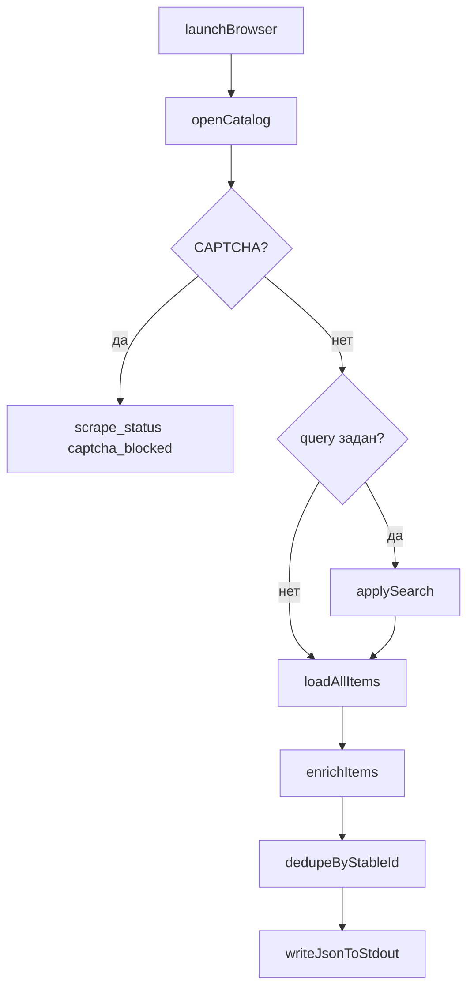

# Требования к скрейперам каталогов монет

Единый стандарт для скрейперов в `tools/coin-catalog-{slug}/`. JSON-ответ валидируется по `[coins_catalog.schema.json](coins_catalog.schema.json)`.

Скрипт **не создаёт файлов** на диске: итоговый JSON пишется **один раз в stdout**; логи — только в stderr.

Legacy-скрипты вне этой структуры (HTTP без Playwright) не переписываются без отдельной задачи.

---

## 1. Схема выходного JSON

Корневой объект (единственная запись в **stdout**):


| Поле            | Тип               | Обязательность | Описание                                |
| --------------- | ----------------- | -------------- | --------------------------------------- |
| `scraped_at`    | string (ISO 8601) | да             | Время начала сбора                      |
| `scrape_status` | string            | да             | `ok` | `captcha_blocked` | `error`      |
| `total_pages`   | int               | да             | Число обработанных страниц каталога     |
| `total_coins`   | int               | да             | `len(coins)`                            |
| `coins`         | array             | да             | Список монет                            |
| `query`         | string            | нет            | Только если передан непустой `--query`  |
| `error`         | string            | нет            | Текст ошибки при `scrape_status` ≠ `ok` |


Элемент массива `coins[]`:


| Поле             | Тип           | Обязательность | Правила                                                         |
| ---------------- | ------------- | -------------- | --------------------------------------------------------------- |
| `catalog_number` | string | null | нет            | Каталожный номер / артикул (например `5216-0060`)               |
| `name`           | string        | да             | Название монеты                                                 |
| `metal`          | string | null | нет            | Только название металла (`Золото`, `Серебро`, …), **без пробы** |
| `weight_g`       | number | null | нет            | Масса в граммах                                                 |
| `buy_price`      | number | null | нет            | Цена выкупа банком (₽)                                          |
| `sell_price`     | number | null | нет            | Цена продажи (₽); `null`, если нет в продаже                    |


Правила сериализации:

- `ensure_ascii=False`, `indent=2`, UTF-8.
- У каждой монеты всегда все 5 ключей; отсутствующие значения — явный `null`.
- `total_coins == len(coins)`.
- В stdout — **ровно один** JSON-объект и перевод строки; никакого другого текста в stdout.

Пример:

```json
{
  "scraped_at": "2026-05-16T16:23:48.555656",
  "scrape_status": "ok",
  "total_pages": 1,
  "total_coins": 1,
  "coins": [
    {
      "catalog_number": "5216-0060",
      "name": "Пример инвестиционной монеты",
      "metal": "Золото",
      "weight_g": 7.78,
      "buy_price": 89500.0,
      "sell_price": 99700.0
    }
  ],
  "query": "золото"
}
```

---

## 2. Технологический стек

- **Python 3**, сбор через **Playwright** (`playwright.async_api`, `async_playwright`), точка входа `asyncio.run(main(...))`.
- Динамическая витрина — только Playwright; вспомогательные `fetch`/XHR допустимы **внутри** контекста страницы.
- Зависимость: `pip install playwright`; браузер: системный Chrome/Edge, fallback — bundled Chromium.
- Обёртка `run_{slug}.sh`: проверка `import playwright`, при отсутствии — `pip install playwright`.

---

## 3. CLI


| Аргумент  | Обязательность | Default               |
| --------- | -------------- | --------------------- |
| `--query` | нет            | `""` — полный каталог |


Рекомендуемые флаги (по необходимости сайта):

- `--timeout`, `--retries`, `--delay` — устойчивость и пагинация.
- `--headful`, `--storage-state`, `--save-storage-state` — антибот/CAPTCHA.
- `--log-level` — см. раздел 4.

Поведение `--query`:

- Непустая строка — фильтрация на витрине (URL-параметр или поле поиска — реализация в скрипте банка).
- В JSON добавляется поле `query`; при пустом `--query` поле не пишется.

Вывод результата:

- Итоговый JSON — в **stdout** (`sys.stdout.write` / `json.dumps` + `\n`).
- Флага `--output` **нет**; запись в файл не выполняется.

Коды выхода: `0` при `scrape_status == "ok"`, иначе `2`.

---

## 4. Логирование

- Модуль `logging`, логгер `logging.getLogger("{slug}_scraper")`.
- `--log-level`: `DEBUG`  `INFO`  `WARNING`  `ERROR`, default `INFO`.
- Формат: `%(asctime)s %(levelname)-7s %(message)s`, `datefmt="%H:%M:%S"`.
- Настройка в `main()` через `logging.basicConfig(..., stream=sys.stderr)` — логи **не попадают в stdout**.
- Штатные сообщения — только через `logging`; `print()` не использовать.
- Исключение: одна запись JSON в stdout (раздел 1), без `logging` и без `print`.


| Уровень | Содержание                                                                                 |
| ------- | ------------------------------------------------------------------------------------------ |
| INFO    | Старт/финиш (баннер `===`), URL каталога, страницы/карточки, итог монет, `scrape_status`   |
| WARNING | Повтор навигации, пропуск дубликата, пустое имя, нет цен, сбой обогащения карточки         |
| ERROR   | CAPTCHA, необработанный сбой Playwright, пустой результат после попыток                    |
| DEBUG   | Пагинация, XHR, промежуточные счётчики                                                     |


---

## 5. Логика сбора (Playwright)




- **Дедупликация** по стабильному id позиции на витрине (`data-id`, URL карточки, sku — что даёт сайт), **не** по артикулу.
- `WARNING` при пропуске дубликата или пустого `name`.
- Блокировка тяжёлых ресурсов (`image`, `media`, `font`) — по усмотрению; `stylesheet` не блокировать, если ломается вёрстка.

---

## 6. Структура tool

Каталог `tools/coin-catalog-{slug}/`:


| Файл                     | Назначение                                 |
| ------------------------ | ------------------------------------------ |
| `scrape_{slug}_coins.py` | Скрипт (Playwright)                        |
| `run_{slug}.sh`          | Обёртка: deps + `python3 scrape_*.py "$@"` |
| `tool.json`              | Конфиг Cursor tool                         |


Шаблон `tool.json`:

```json
{
  "name": "coin-catalog-{slug}",
  "description": "Получает каталог монет и возвращает JSON в stdout.",
  "command": "./run_{slug}.sh",
  "args": [],
  "parameters": [
    {
      "name": "query",
      "description": "Строка поиска в каталоге",
      "required": false,
      "cli": ["--query", "{query}"]
    }
  ],
  "working_directory": "tools/coin-catalog-{slug}"
}
```

- `args` может быть пустым: `--query` задаётся через `parameters`.
- Поля `output_file` в `tool.json` **нет** — результат читается из stdout процесса.
- Регистрация в `[tools/tools.json](../tools/tools.json)`.
- Скилл `skills/coin-catalog-{slug}/SKILL.md`.

---

## 7. Критерии приёмки

- Playwright для навигации и рендера каталога.
- Необязательный `--query`; флага `--output` нет.
- Скрипт **не создаёт** файлов (в т.ч. `coins_{slug}_catalog.json`).
- JSON по п.1 в **stdout**; `metal` без пробы; явные `null`.
- `total_coins == len(coins)`; при поиске — поле `query` в корне.
- Логирование по п.4 (`--log-level`) в stderr; stdout — только JSON.
- `tool.json`, `run_*.sh`, запись в `tools/tools.json`, skill.
- Прогон без аргументов и с `--query "…"` даёт валидный JSON в stdout.
